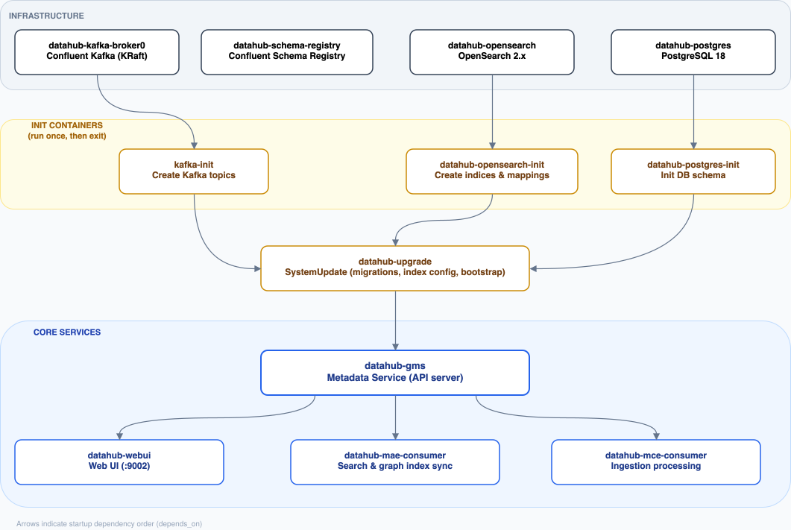

# Data Catalog with DataHub

[](https://docs.confluent.io/platform/current/)
[](https://docs.docker.com/get-docker/)

This setup replicates a production Kubernetes Helm deployment using Docker Compose.



### Core Services

| Service                  | Purpose |
|--------------------------|---|
| **datahub-gms**          | Generalized Metadata Service. The central API server that handles all metadata CRUD operations, search, and graph queries |
| **datahub-frontend**     | React-based Web UI for browsing metadata, lineage, and managing the data catalog |
| **datahub-mae-consumer** | Metadata Change Log consumer. Processes committed metadata changes and updates secondary indexes (OpenSearch) to keep search and graph in sync with the primary database |
| **datahub-mce-consumer** | Metadata Change Proposal consumer. Processes inbound ingestion proposals from Kafka and writes them to the primary database (PostgreSQL) |

### Infrastructure Dependencies

| Service | Purpose |
|---|---|
| **datahub-postgres** | PostgreSQL as the primary metadata storage backend |
| **datahub-opensearch** | OpenSearch 2.x for full-text search and graph traversal (`GRAPH_SERVICE_IMPL=elasticsearch`) |
| **datahub-kafka-broker0** | Kafka broker (KRaft mode, no ZooKeeper) used as the event streaming backbone for metadata change events (MCP/MCL) |
| **datahub-schema-registry** | Confluent Schema Registry for Avro schema management of Kafka topics |

### Init Containers (run once, then exit)

| Service | Purpose |
|---|---|
| **datahub-postgres-init** | Initializes the PostgreSQL database schema |
| **datahub-opensearch-init** | Creates and configures OpenSearch indices and mappings |
| **datahub-kafka-init** | Pre-creates required Kafka topics |
| **datahub-upgrade** | Runs `-u SystemUpdate` to apply database schema migrations, OpenSearch index mappings, bootstrap configs, and BrowsePathsV2 backfills. Must run on every version change before GMS starts. On repeated runs of the same version it's effectively a no-op and exits quickly |

### Monitoring (Conduktor)

| Service | Purpose |
|---|---|
| **conduktor-console** | Web UI for managing and monitoring the Kafka cluster |
| **conduktor-metastore** | PostgreSQL instance used internally by Conduktor |
| **conduktor-cortex** | Monitoring backend for Conduktor (Cortex + Alertmanager + Prometheus APIs) |


## Getting Started

**1.** Spin up the whole stack with:

```shell
docker compose up -d
```

**2.** Access [DataHub Web UI on http://localhost:9002](http://localhost:9002)

**3.** (Optional) Access [Conduktor Web UI for Kafka on http://localhost:9000](http://localhost:9000)


## DataHub Custom Recipe Ingestion

### Stateful Ingestion with datahub-kafka Sink

- Metadata events (table schemas, lineage, views, etc.) are pushed to Kafka, which GMS consumes asynchronously — this is typically higher throughput and decouples the ingestion pipeline from GMS availability.
- Pipeline state (what was seen in the last run) is read/written via the REST API (datahub_api). This is how `remove_stale_metadata` works — it compares the current run's entities against the previous run's state stored in GMS, and emits soft-delete events for anything that disappeared (e.g., a dropped table).

So the two channels serve different purposes: Kafka for the bulk metadata flow, REST for the lightweight state bookkeeping.

### Stateful Ingestion with datahub-rest Sink

- Both metadata events and pipeline state are sent through the same REST API (GMS). This is simpler to configure since no separate `datahub_api` block is needed — the sink itself handles state management.
- Ingestion is synchronous: each metadata event is written directly to GMS and acknowledged before the next one is sent. This makes it easier to debug but may have lower throughput compared to the Kafka sink.
- Stateful ingestion (`remove_stale_metadata`) works out of the box with no additional configuration beyond enabling it in the source config.

### BigQuery

**4.1.** Local Run:
```shell
export DATAHUB_REST_SERVER=http://host.docker.internal:9090
export DATAHUB_KAFKA_BOOSTRAP_SERVERS=host.docker.internal:9092
export DATAHUB_SCHEMA_REGISTRY_URL=http://host.docker.internal:8081
```
```shell
uv run datahub ingest -c recipes/bigquery.yml
```

**4.2** Docker run:
```shell
docker build -t datahub-bigquery-ingest:latest -f Dockerfile.bigquery . --no-cache
```
```shell
docker run --rm \
  -e DATAHUB_REST_SERVER=http://host.docker.internal:9090 \
  -e DATAHUB_KAFKA_BOOSTRAP_SERVERS=host.docker.internal:9093 \
  -e DATAHUB_SCHEMA_REGISTRY_URL=http://host.docker.internal:8081 \
  -v ${GOOGLE_APPLICATION_CREDENTIALS}:/secrets/gcp_credentials.json \
  datahub-bigquery-ingest:latest
```

### Metabase

**5.1.** Local Run:
```shell
export DATAHUB_REST_SERVER=http://host.docker.internal:9090
export DATAHUB_KAFKA_BOOSTRAP_SERVERS=host.docker.internal:9092
export DATAHUB_SCHEMA_REGISTRY_URL=http://host.docker.internal:8081
export METABASE_URL=http://host.docker.internal:3000
export METABASE_API_KEY=<metabase-api-key>
```
```shell
uv run datahub ingest -c recipes/metabase.yml
```

**5.2.** Docker run:
```shell
docker build -t datahub-metabase-ingest:latest -f Dockerfile.metabase . --no-cache
```
```shell
docker run --rm \
  -e DATAHUB_REST_SERVER=http://host.docker.internal:9090 \
  -e DATAHUB_KAFKA_BOOSTRAP_SERVERS=host.docker.internal:9093 \
  -e DATAHUB_SCHEMA_REGISTRY_URL=http://host.docker.internal:8081 \
  -e METABASE_URL=http://host.docker.internal:3000 \
  -e METABASE_API_KEY=${METABASE_API_KEY} \
  datahub-metabase-ingest:latest
```

### PostgreSQL

**6.1.** Local Run:
```shell
export DATAHUB_REST_SERVER=http://host.docker.internal:9090
export DATAHUB_KAFKA_BOOSTRAP_SERVERS=host.docker.internal:9092
export DATAHUB_SCHEMA_REGISTRY_URL=http://host.docker.internal:8081
export POSTGRES_HOST=host.docker.internal
export POSTGRES_PORT=5432
export POSTGRES_DB=reverse_etl
export POSTGRES_USER=postgres
export POSTGRES_PASSWORD=postgres
```
```shell
uv run datahub ingest -c recipes/postgres.yml
```

**6.2.** Docker run:
```shell
docker build -t datahub-postgres-ingest:latest -f Dockerfile.postgres . --no-cache
```
```shell
docker run --rm \
  -e DATAHUB_REST_SERVER=http://host.docker.internal:9090 \
  -e DATAHUB_KAFKA_BOOSTRAP_SERVERS=host.docker.internal:9093 \
  -e DATAHUB_SCHEMA_REGISTRY_URL=http://host.docker.internal:8081 \
  -e POSTGRES_HOST=host.docker.internal \
  -e POSTGRES_PORT=5432 \
  -e POSTGRES_DB=reverse_etl \
  -e POSTGRES_USER=postgres \
  -e POSTGRES_PASSWORD=postgres \
  datahub-postgres-ingest:latest
```


## GraphQL Queries

To get a better idea of how the entities are modeles on DataHub as `dataFlow`, `dataJob`, `dataProcessInstance`, `dataSets`, among others. You can use the following Postman Collection of GraphQL queries:

```
https://www.postman.com/iobruno/workspace/vault/collection/6983fb194d8a7c94d2b82c6b?action=share&creator=52118286
```


## TODO's:
- [x] Single-broker Kafka Cluster (with KRaft)
- [x] Kafka Admin UI: `Conduktor Console`
- [x] Spin-up DataHub using Kafka-Kraft
- [x] Build a Docker Image for ingesting custom recipes (e.g.: dbt-core)
- [x] Create a Repository/Collection of useful GraphQL Queries for debugging
